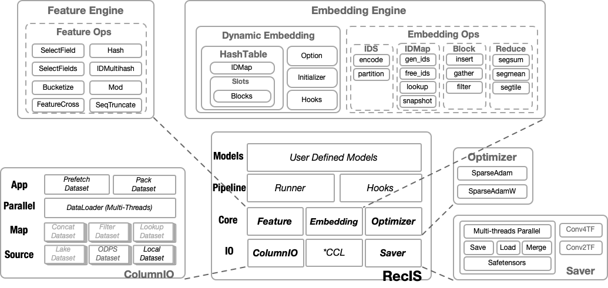

Project Introduction
===================

What is RecIS
------------

RecIS is a unified architecture deep learning framework designed specifically for ultra-large-scale sparse models. It is built on the PyTorch open-source ecosystem and provides a complete solution for sparse training, or combined sparse and multimodal/large model computation.

Design Goals
------------

- **Ultra-large Scale Support**: Unified architecture for ultra-large-scale sparse models
- **High Performance**: Built on PyTorch open-source ecosystem with sparse model sharding optimization
- **Ease to Use**: Provides clean API design with native computation optimization techniques
- **Compatibility**: Fully compatible with existing PyTorch ecosystem

Core Architecture
-----------------

RecIS adopts a modular design and mainly includes the following core components:

**IO Layer**
  Responsible for ORC data reading and preprocessing, providing optimization capabilities such as multi-threading processing / data prefetching / state recording

**Feature Processing Layer**
  Provides feature engineering and feature transformation processing capabilities, and supports transformation operator fusion optimization strategies

**Computation Layer**
  - Sparse Computation: HashTable-based dynamic embedding with feature elimination support
  - Dense Computation: Native PyTorch support

**Training Framework Layer**
  Provides complete training, evaluation, and model management capabilities

Application Scenarios
----------------------

RecIS is particularly suitable for the following scenarios:

- **Recommendation Systems**: Large-scale sparse feature recommendation model training
- **Advertising Systems**: CTR/CVR prediction models
- **Search Ranking**: Search result ranking models
- **Multimodal Learning**: Models combining multimodal data such as text and images

Technical Advantages
--------------------

**Sparse Computation Optimization**
  - Dynamically expandable embedding tables
  - Efficient HashTable implementation
  - Sparse parameter sharding and optimization
  - Support for feature elimination strategies

**IO Performance Optimization**
  - Multi-threaded parallel data reading and processing
  - Support for data prefetching
  - Support for direct data packing to GPU / pin_memory

**Distributed Training**
  - Native support for distributed training
  - Gradient accumulation and synchronization optimization
  - Model parallelism and data parallelism

**Computation Optimization**
  - Mixed precision training
  - Operator fusion optimization